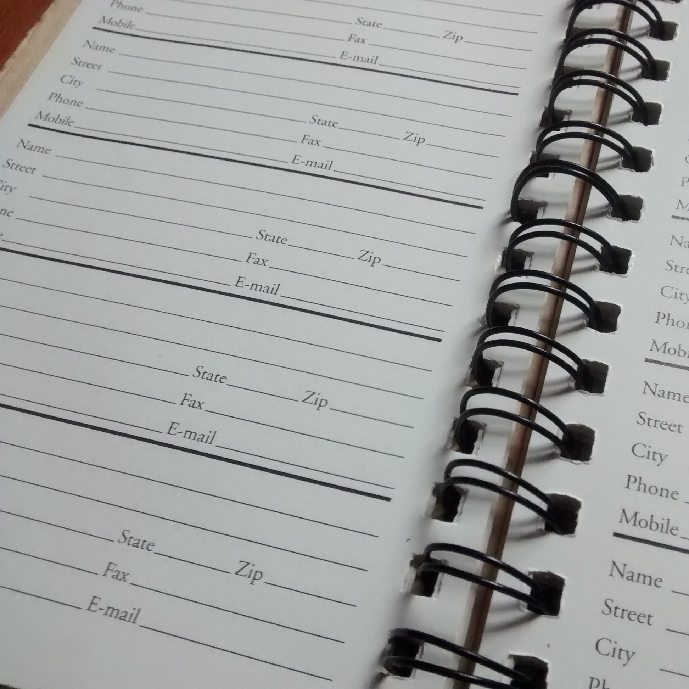

This app functions as an address book of contacts, where users can log in and create contacts with fields for names, addresses, and phone numbers.
 

Building digits was a key part of learning to create applications with the meteor framework. At times, it was challenging getting the app to build from the command prompt, but with some time and effort I was able to get it functioning pretty close to my instructor's version.

One challenge building this app was trying to follow each step from the instructional tutorial videos found on our course website starting [here](http://courses.ics.hawaii.edu/ics314f16/morea/meteor-2/experience-meteor-digits-1.html). Sometimmes, I might lose track of my place in the video and have to try to retrace my steps. I ended up trying to thoroughly document each step given in the video, so I would have more concrete steps to refer to.

View the code [here](https://github.com/matthew-schultz/digits).

