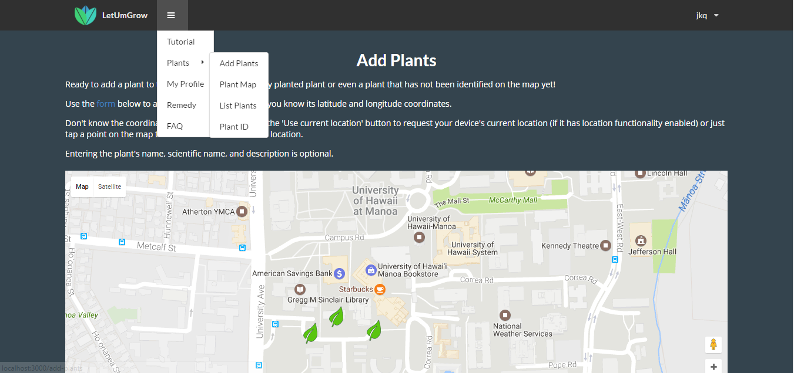

[Link to the original app proposal](https://matthew-schultz.github.io/essays/botaniary.html)

[Link to the LetUmGrow app informational page](https://letumgrow.github.io)

This web app serves as a database of plant data linked with their locations on a map. Users can add new plants they find, edit profile pages of existing plants, and edit their personal profile pages. Also included is an information page on remedies that incorporate Hawaiian Medicine and local plants.
View the Github repository [here](https://github.com/letumgrow/letumgrow).

Future: Defining vision